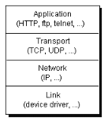
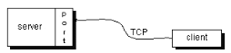

# Tutorial Java Networking
#
## 1. Pendahuluan
Sederhananya Java Networking membahas tentang komunikasi antar perangkat/program melalui jaringan komputer. Java Networking membahas TCP, UDP, IP, Socket, Komunikasi End-to-end, dll. Terdapat pada package java.net untuk class yang dibutuhkan, seperti URL, Socket, URLConnection, dll.  



#### TCP
TCP(Transmission Control Protocol) adalah protokol internet yang menyediakan saluran untuk transmisi data/komunikasi antar perangkat. TCP menyediakan koneksi seperti HTTP, HTTPS, FTP, dll.

#### UDP
UDP(User Datagram Protocol) adalah protokol internet untuk komunikasi antar perangkat yang tidak menjamin keutuhan data, disebut ***Datagram*** karena data dikirim secara independen (sendiri). Namun kecepatan transfer lebih cepat dari TCP.  
***"Kebanyakan konfigurasi dasar Router/Firewall tidak mengijinkan protokol UDP"***

#### IP
IP atau Internet Protocol adalah kompulan nilai numerik pada perangkat yang terhubung ke jaringan. IP digunakan untuk menandai atau sebagai identitas perangkat pada sebuah jaringan, juga digunakan untuk komunikasi.

#### Socket

#### Port




## 2. URL
URL(Uniform Resource Locator) adalah sebuah kompulan huruf, simbol, & angka berfungsi sebagai alamat sesuatu pada jaringan. Untuk format Url.  

> ## https://youtube.com/home/earth.mp4

- https:// = protokol
- youtube.com = domains/website
- /home = sub domains/sub path
- /earth.mp4 = file

Pada package java.net ada kelas URL. Untuk langkah-langkahnya.

- Membuat objek URL
- Parsing URL
- Membuka koneksi stream URL
- Mengkoneksikan URL
- Baca & Tulis pada URL

#### 2.1 Membuat objek URL
Untuk membuat objek URL yang sederhana dengan memasukan url pada argumen.
```Java
// Format
// Untuk Java SE > 20 sudah deprecated
URL url = new URL("https://tokopedia.com");

// Dengan url yang spesifik
URL url = new URL("https://tokopedia.com/home");

...
```
Kelas URL juga mendukung untuk url spesial seperti.
```Java
new URL("https://example.com/hello world/");

new URL("https://example.com/hello%20world");

...
```
Bisa juga menggunakan kelas URI untuk memasukan url dengan format yang berbeda.
```Java
URI uri = new URI("https", "tokopedia.com", "/hello world/", "");

// Lalu konversikan
URL url = uri.toURL();
```

#### 2.2 MalformedURLException
Setiap kelas URL,URI,dsb akan melempar pengecualian (Exception) berupa MalformedURLException, URISyntaxException, dsb.
```Java
public class Main {
	public static void main(String[] args) {
		URL url = new URL("https://tokopedia.com");
	}
}
```
Output.
```Bash
Main.java:9: error: unreported exception URISyntaxException; must be caught or declared to be thrown
                URL url = new URL("https://tokopedia.com");
```
Bisa menggunakan try catch atau throws.
```Java
// Try Catch
public class Main {
	public static void main(String[] args) {
		try {
		    URL url = new URL("https://tokopedia.com");
		}
		catch (MalformedURLException e) {
		    ...
		}	
	}
}

// throws
public class Main {
	public static void main(String[] args) throws MalformedURLException {
		URL url = new URL("https://tokopedia.com");
	}
}
```

#### 2.3 Informasi pada Url
Beberapa operasi yang ada untuk interaksi/mendapat informasi pada Url.

- **getProtocol()**
- **getAuthority()**
- **getHost()**
- **getPort()**
- **getPath()**
- **getFile()**
- **getQuery()**
- **getRef()**
- ...

Sebetulnya ada banyak fungsi-fungsi lainnya, contoh program menggunakan fungsi-fungsi diatas.
```Java
public class Main {
	public static void main(String[] args) throws MalformedURLException, URISyntaxException, IOException {

		URI uri = new URI("https://https://www.google.com/search?q=earth+images&sca_esv=591053097&rlz=1C1KNTJ_enID1079ID1079&tbm=isch&sxsrf=AM9HkKk5yVuvRUODGAAqE3rBZWH1X7ss5g:1702608044169&source=lnms&sa=X&sqi=2&ved=2ahUKEwi7gKidtZCDAxWxUGwGHeqGArwQ_AUoAXoECAEQAw&biw=1327&bih=851&dpr=0.8#imgrc=ud-_wzRDjQ6-UM");
		URL url = uri.toURL();

		System.out.println(url.getAuthority());
		System.out.println(url.getFile());
		System.out.println(url.getRef());
		System.out.println(url.getHost());
		System.out.println(url.getPath());
		System.out.println(url.getProtocol());
	}
}
```
Output.
```Bash
https:
//www.google.com/search?q=earth+images&sca_esv=591053097&rlz=1C1KNTJ_enID1079ID1079&tbm=isch&sxsrf=AM9HkKk5yVuvRUODGAAqE3rBZWH1X7ss5g:1702608044169&source=lnms&sa=X&sqi=2&ved=2ahUKEwi7gKidtZCDAxWxUGwGHeqGArwQ_AUoAXoECAEQAw&biw=1327&bih=851&dpr=0.8
imgrc=ud-_wzRDjQ6-UM
https
//www.google.com/search
https
```

#### 2.4 Membuka koneksi openStream()
Setelah membuat objek URL panggil fungsi openStream() untuk membuka koneksi stream, ini digunakan untuk membaca infomasi dari url. Fungsi openStream() akan mengembalikan objek java.io.InputStream

```Java
public class Main {
	public static void main(String[] args) throws MalformedURLException, URISyntaxException, IOException {

		URI uri = new URI("https://www.oracle.com");
		URL url = uri.toURL();

		// Buka koneksi dengan fungsi openStream()
		BufferedReader br = new BufferedReader(new InputStreamReader(url.openStream()));

		String line;

		while((line = br.readLine()) != null) {
			System.out.println(line);
		}
		br.close();
	}
}
```
Output.
```JSON
"link":"https://www.oracle.com/cloud/",
"cta_buttons":null,
"title":"Oracle Cloud Infrastructure",
"image_alt_text":null,
"contacts":
	{
		"contacts":[]},
		"quotes":null
	},
"mimeType":"contentItem",
"fileGroup":"contentItem",
"links":[]},
	{
		"id":"COREB7D02AFE4E07482EA7CE6A7FB6347BB7",
		"type":"SH-ProductDetail",
		"typeCategory":"ContentType",
		"name":"Oracle NetSuite",
		"description":"",
		"slug":"oracle-netsuite",
		"language":"en-US",
		"translatable":true,
		"createdDate":
			{
				"value":"2021-12-16T12:59:07.357Z",
				"timezone":"UTC"
			},
		"updatedDate":
			{
				"value":"2021-12-16T12:59:07.357Z",
				"timezone":"UTC"
			},
	}
	...
...
```

#### 2.5 Membuka koneksi openConnection()
Bisa juga membuka koneksi dengan fungsi openConnection() dengan nilai kembalian URLConnection. 
```Java
public class Main {
	public static void main(String[] args) throws MalformedURLException, URISyntaxException, IOException {
		URI uri = new URI("https://www.oracle.com");
		URL url = uri.toURL();

		// openConnection() akan melempar Exception
		// Bisa dengan try catch atau throws
		URLConnection urlc = url.openConnection();

		urlc.connect();
	}
}
```
Tidak harus memanggil fungsi connect(), bisa dengan fungsi yang lain seperti **getInputStream**, **getOutputStream**. Kemudian kita bisa mengambil informasi lewat fungsi pada objek **URLConnection**.
```Java
public class Main {
	public static void main(String[] args) throws MalformedURLException, URISyntaxException, IOException {
		URI uri = new URI("https://www.oracle.com");
		URL url = uri.toURL();

		// openConnection() akan melempar Exception
		// Bisa dengan try catch atau throws
		URLConnection urlc = url.openConnection();

		urlc.connect();

		System.out.println(urlc.getContent());
		System.out.println(urlc.getContentLength());
		System.out.println(urlc.toString());
	}
}
```
Output.
```Bash
sun.net.www.protocol.http.HttpURLConnection$HttpInputStream@69b794e2
-1
sun.net.www.protocol.https.DelegateHttpsURLConnection:https://www.oracle.com
```

#### 2.6 Baca & Tulis ke URL
Pada kelas **URLConnection** ada terdapat fungsi-fungsi untuk membaca atau menulis ke koneksi url, protokol URL juga mengijinkan untuk membaca & menulis.

##### Membaca koneksi URL
Karena akan membaca koneksi URL maka kita menggunakan fungsi **getInputStream**.
```Java
public class Main {
	public static void main(String[] args) throws MalformedURLException, URISyntaxException, IOException {
		
		URI uri = new URI("https://www.oracle.com");
		URL url = url = uri.toURL();
		URLConnection urlc = url.openConnection();
		BufferedReader br = new BufferedReader(new InputStreamReader(urlc.getInputStream()));

		String line;
		while((line = br.readLine()) != null) {
			System.out.println(line);
		}
		
		br.close();
	}
}
```
Output.
```HTML
a platform that lets fans earn points to gain access to exclusive merchandise and digital downloads. 
Since its launch, The Red Bull Racing Paddock has grown its loyalty membership by more than 950%.
Oracle.\u0026rdquo;\u003c/p\u003e\n",
"facebook_url":null,
"twitter_image_alt_text":null,
"facebook_sitename":null,
"story_top_products_portfolio":[
	{
		"id":"CORE86A94D28504D4AB2A32C4924A5EE5670",
		"type":"SH-ProductDetail",
		"typeCategory":"ContentType",
		"name":"Oracle Cloud Infrastructure",
		"description":"",
		"slug":"1481790393690-oracle-cloud-infrastructure",
		"language":"en-US",
		"translatable":true,
		"createdDate":
			{"value":"2020-10-15T11:09:11.428Z","timezone":"UTC"},
		"updatedDate":
			{"value":"2023-04-04T17:22:02.346Z","timezone":"UTC"},
			"fileExtension":"contentItem"
		...
	}
...
```

##### Menulis ke koneksi URL
Menulis maksudnya mengirim data lewat koneksi URL, sebuah website mesti ada kolom berisi kata, gambar yang bisa kita masukan. Untuk mengirim data, menggunakan HTTP POST METHOD untuk mengirim data ke server/tujuan.  
Contoh dengan server sederhana, membuat server lalu mengirim sebuah data yang kemudian akan di reverse/dibalik datanya.
```Java


```

## 3. Soket
Soket adalah komunikasi end-point dua arah program yang berada pada jaringan. Pada package java.net ada 2 kelas untuk kebutuhan Soket **(Socket & ServerSocket)**.

#### Cara kerja soket
Server berjalan pada komputer A & nilai port yang tertentu, server akan terus menunggu hingga klien menjalin koneksi pada port yang sama.  

- **Pada sisi klien, klien mengirim permintaan koneksi, mengirim ke port listening server & klien meidentifikasinya.**


- **Lalu sisi server menyetujui dan membuat soket bund baru dengan nilai port yang sama.**


***"Definisi: Soket adalah salah satu titik akhir dari hubungan komunikasi dua arah antara dua program yang berjalan di jaringan. Soket terikat ke nomor port sehingga lapisan TCP dapat mengidentifikasi aplikasi tujuan pengiriman data."***

#### Baca & Tulis pada Soket
Contoh sederhana bagaimana membuat koneksi menggunakan soket (Socket.java), dan bagaimana klien mengirim dan menerima data dari server.


